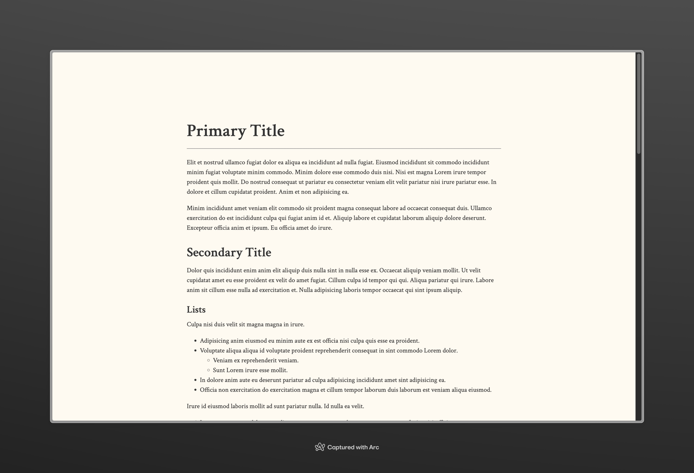
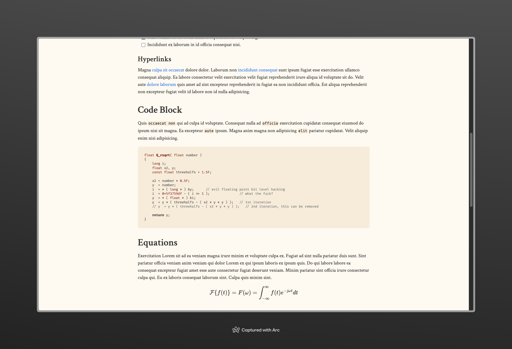
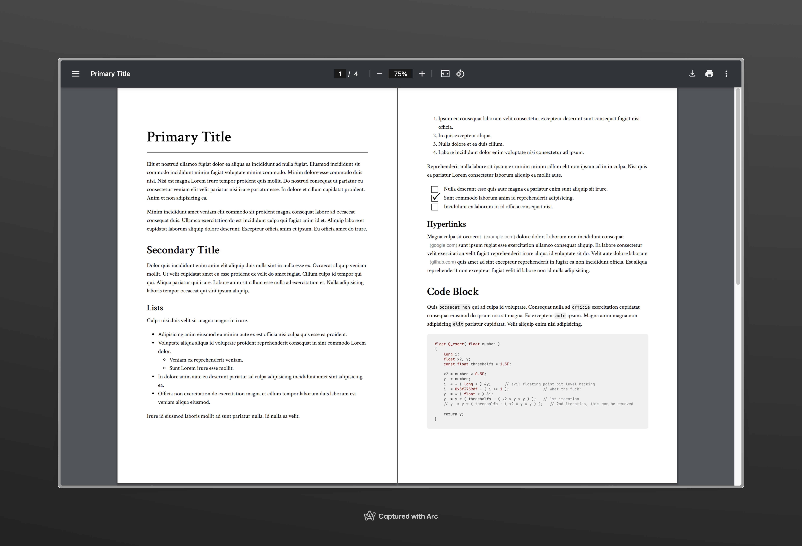
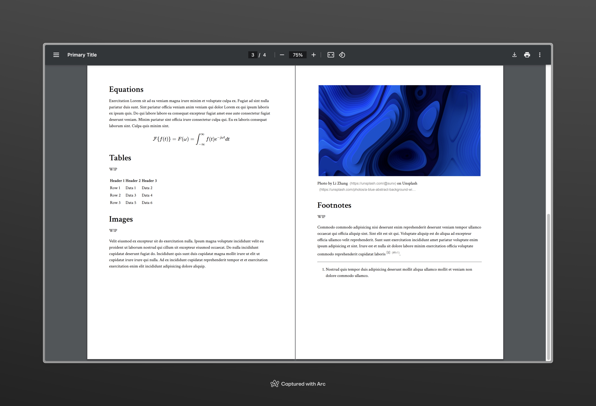

# Markdown CSS for Essay Writing

CSS for your markdown essays. Enhancing HTML reading experience and exporting printable PDFs.

## Use in Markdown Files

You'll need tools that convert Markdown into HTML, `pandoc` or a few VSC extensions would work well.

You can directly download the compiled .css (or .min.css) in [releases](https://github.com/Arcadi4/markdown-css-for-essay-writing/releases).

Add the following line to your Markdown file:

```html
<link rel="stylesheet" href="path/to/main.css" />
```

For code blocks, you might need to break lines manually so they won't be truncated. Keeping around `50` characters at most in a line.

## Code Block Highlighting

You may use this CSS with [highlight.js](https://highlightjs.org/) for code block highlighting (remember to label the language used in code blocks).

Add the following code to your Markdown file, or choose a CDN you prefer on [their site](https://highlightjs.org/):

```html
<!-- highlight.js -->
<link rel="stylesheet" href="https://cdnjs.cloudflare.com/ajax/libs/highlight.js/11.9.0/styles/default.min.css">
<script src="https://cdnjs.cloudflare.com/ajax/libs/highlight.js/11.9.0/highlight.min.js"></script>
<script src="https://cdnjs.cloudflare.com/ajax/libs/highlight.js
<script>hljs.highlightAll();</script>
```

## Images

### HTML pages





### Exported PDFs





## Compile

First, clone the repository:

```bash
git clone https://github.com/Arcadi4/markdown-css-for-essay-writing
cd markdown-css-for-essay-writing
```

Install `sass` if you haven't already:

```bash
npm install -g sass
```

Or, if you prefer using `yarn`:

```bash
yarn global add sass
```

Then run the following command to compile the SCSS file to CSS:

```bash
sass main.scss:main.css --style compressed main.scss:main.min.css
```
