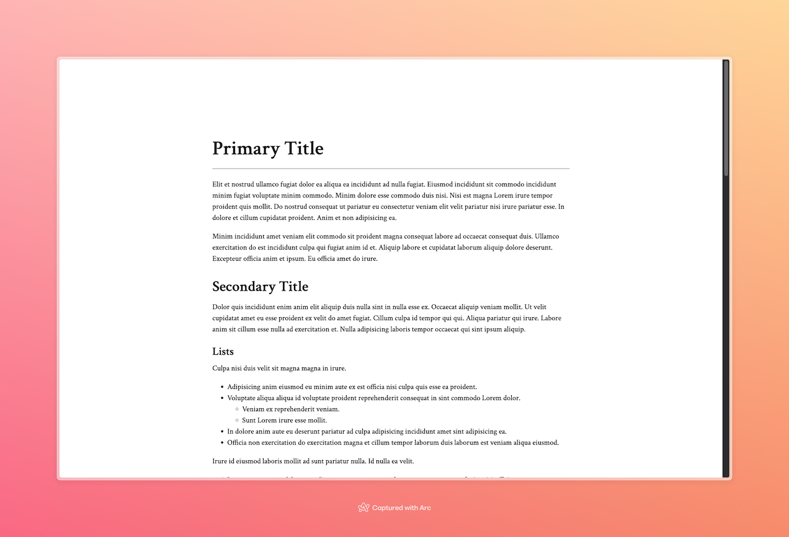
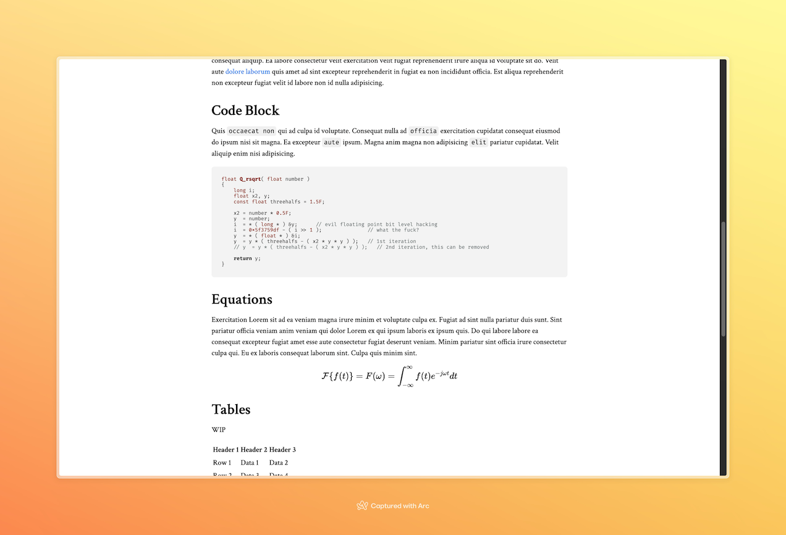

# Markdown CSS for Essay Writing

Simple SCSS can be used to style your Markdown files for essay writing.





## Setup

First, clone the repository:

```bash
git clone https://github.com/Arcadi4/markdown-css-for-essay-writing
cd markdown-css-for-essay-writing
```

Install `sass` if you haven't already:

```bash
npm install -g sass
```

Or, if you prefer using `yarn`:

```bash
yarn global add sass
```

Then run the following command to compile the SCSS file to CSS:

```bash
sass main.scss:main.css --style compressed main.scss:main.min.css
```

## Use in Markdown Files

You'll need tools that convert Markdown into HTML, `pandoc` or a few VSC extensions would work well.

Add the following line to your Markdown file:

```html
<link rel="stylesheet" href="path/to/main.css" />
```

You might need to break lines manually for code blocks, keeping at most around `50` characters in a line.

## Code Block Highlighting

Consider using this with [highlight.js](https://highlightjs.org/). Add the following code to your Markdown file.

```html
<!-- highlight.js -->
<link rel="stylesheet" href="https://cdnjs.cloudflare.com/ajax/libs/highlight.js/11.9.0/styles/default.min.css">
<script src="https://cdnjs.cloudflare.com/ajax/libs/highlight.js/11.9.0/highlight.min.js"></script>
<script src="https://cdnjs.cloudflare.com/ajax/libs/highlight.js
<script>hljs.highlightAll();</script>
```
